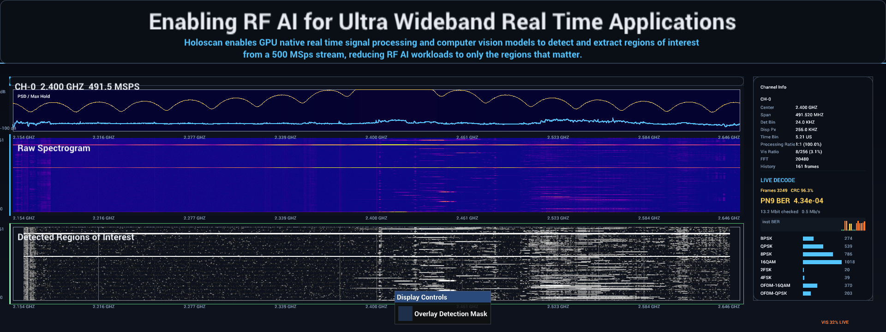
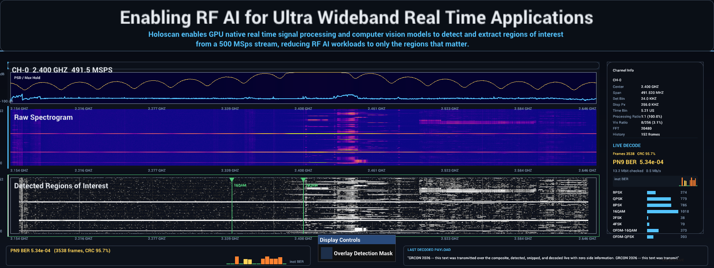
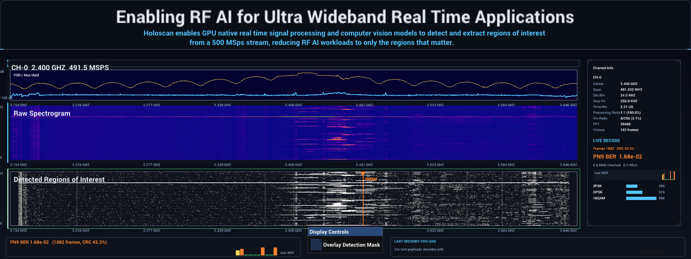
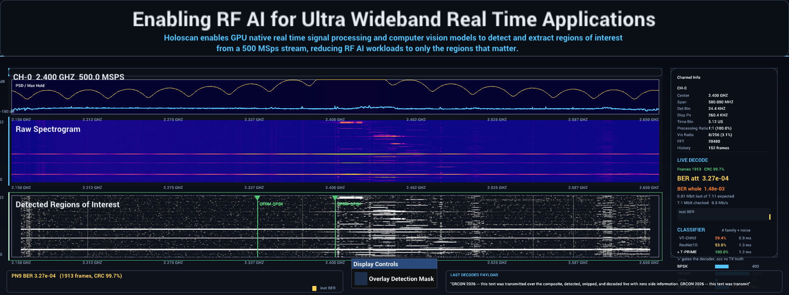

# pycodec end-to-end: detect → snip → decode (offline, 2026-08-15)

First full rehearsal of the real-time decode chain, entirely in Python on the
Spark — no MATLAB anywhere:

```
comprehensive_ordered_py (pycodec composite, 245.76 MSps, 48 placements)
  -> offline detection run (coherent_power + signal_snipper + sigmf_file_sink,
     config_signal_snipper_single_channel.yaml via run_cuda_dino_offline_file.py --snippets-only)
  -> decode_snippets.py: match snippets to TX truth, mix residual, pycodec decode
```

## Result

| Metric | Value |
| --- | --- |
| Truth placements | 48 (BPSK/QPSK × RRC/RC × 20/10/5/1/0.2/0.04 ms) |
| Detected + decoded | **40/48** |
| Aggregate BER over decoded bits | **0 / 12,787,450 = 0.0** |
| Worst placement BER | 0.0 |
| Time coverage of decoded placements | 100% each |

The 8 misses are exactly the **0.04 ms duration tier** (all 8 waveforms of the
last pass): at the 245.76 MSps offline geometry one FFT row spans 41.7 µs, so a
40 µs burst is ~1 mask row — below the detector's morphology/persistence
minimum (~3 rows ≈ 125 µs). That is a detector design point (short-burst
sensitivity), not a decode limitation; the 0.2 ms tier (~5 rows) detects and
decodes flawlessly.

## How to reproduce

```bash
# 1. build the composite (see pycodec/README.md in holoscan_waveform_generation)
# 2. offline detect + snip:
python3 run_cuda_dino_offline_file.py \
  ~/Documents/holoscan_waveform_generation/composition/composites/comprehensive_ordered_py.sigmf-data \
  --detector coherent_power --config config_signal_snipper_single_channel.yaml \
  --snippets-only --output-root /tmp/usrp_spectrograms/pycodec_e2e
# 3. decode:
python3 infocom_evals/pycodec_e2e/decode_snippets.py \
  --truth ~/Documents/holoscan_waveform_generation/composition/composites/comprehensive_ordered_py.sigmf-meta \
  --snips /tmp/usrp_spectrograms/pycodec_e2e/snippets
```

## Notes / next

- The driver is truth-driven (uses wfgt:source_mat to pick the modulation spec):
  the next step toward live is a header/classifier-driven variant, or the framed
  mode (preamble + modulation header + CRC) so snippets self-describe.
- Snippets carried decimation_factor 1 here (noise-free composite → wide boxes);
  the driver already handles decimated snips via wfgt:snippet_sample_rate.
- Live integration target: the same decode logic consuming sigmf_file_sink
  output (or an in-process mask+IQ tap) with a PN9-BER readout in the demo.

## Addendum — REAL-TIME framed decode with live BER metrics (2026-08-15)

`rt_decode_daemon.py` ran concurrently with the detection pipeline processing
the framed composite (`comprehensive_framed_py`): it consumed signal_snipper
packs as they appeared and decoded every snippet **with zero ground truth** —
sub-band channelization (merged detection boxes), blind symbol-rate estimation,
residual-CFO correction, self-describing frame headers, per-frame CRC, live
PN9 BER:

```
[16:45:48] === LIVE: frames 816 (crc_ok 812) by_mod {'BPSK': 277, 'QPSK': 539}
           PN9 BER 1.08e-04 (361/3342336) ===
```

99.5% of frames CRC-verified with BER 0; the handful of failures are frames
clipped at snippet time-boundaries (the CRC flags them — which is its job).
Metrics also stream to `rt_metrics.json` for a future HoloViz overlay.
Remaining polish for the demo: snip-boundary edge guard, decode-throughput
optimization (pure-numpy prototype runs ~100 ms per short snip), and a native
in-graph operator (or holoviz overlay feed) instead of the file-tail sidecar.

## Addendum 2 — six modulation families through the live chain (2026-08-15)

pycodec grew 16QAM, 8PSK, framed GFSK (2FSK/4FSK, noncoherent), and generic
framed OFDM (64-FFT, pilots, LTF channel est). The daemon now runs a family
cascade per channelized sub-band: constant envelope -> FSK discriminator;
else linear framed; else OFDM at the profile-snapped rate.

Concurrent detect+snip+decode over `comprehensive_framed_py` (36 placements,
6 classes x 3 durations):

```
frames_decoded 3249   crc_ok 3130 (96.3%)   PN9 BER 4.3e-04
by_mod: BPSK 274, QPSK 539, 8PSK 786, 16QAM 1018, 2FSK 20, 4FSK 39,
        OFDM-QPSK/OFDM-16QAM 573
```

Every family decodes blind in real time; CRC failures remain concentrated at
snippet time-boundary clips (plus marginal 4FSK, whose I&D filter is not
Gaussian-matched yet). This is the classifier-ready substrate: six visually
and statistically distinct classes, each with self-describing ground truth.

## Addendum 3 — LIVE DECODE dashboard panel (2026-08-15)

The HoloViz sidebar now renders a **LIVE DECODE** panel fed by the decode
daemon's `rt_metrics.json` (config: `visualization.renderer.decode_metrics_json`):
frames + CRC pass rate (color-coded), the aggregate PN9 BER as the headline
number, Mbit checked + decode throughput, an instantaneous-BER sparkline
(log-scaled, per poll interval), and per-modulation frame-count bars.

Captured live (single-channel 2.4 GHz ambient RF on the waterfall, decode
metrics from a concurrent framed-composite sweep), via the new dashboard-only
render-buffer screenshot path (`visualization.screenshot_path` +
`screenshot_after_frames`, headless-friendly — never touches the desktop):



Iteration knobs on the table: panel placement/size, a wider BER history strip
under the waterfalls, per-band decode markers drawn onto the detection panel,
frames/s + pipeline-latency readouts (from the existing timing summaries), and
a "last decoded payload" text ticker for arbitrary-payload demos.

## Addendum 4 — dashboard v2 (2026-08-15)

v2 adds the three requested elements:
1. **Footer BER strip** (full-width, left): headline PN9 BER + frame/CRC counts
   with the log-scaled instantaneous-BER bar history.
2. **Decode markers** on the Detected Regions panel: a green (CRC ok) / orange
   (CRC fail) flag + modulation label + drop-line at each recently-decoded
   band's frequency (daemon streams `recent_decodes`; sub-GHz marker
   frequencies are treated as baseband offsets from the channel center).
3. **Payload ticker** (footer right): the last CRC-verified arbitrary-text
   payload — fed by a new `framedtext` composite entry, so the demo shows a
   real message that traveled composite → detector → snipper → blind decode.

Composites are now >=1 ms only (framed [20,5,1] ms with 1024-bit FSK frames so
every tier decodes; ordered [20,10,5,1] ms re-verified 32/32 at BER 0).



## Addendum 5 — low-SNR staircase: BER intentionally degrading (2026-08-15)

`pycodec.snr_staircase` builds a capture where QPSK/2FSK/16QAM repeat through
descending in-band SNR steps (30 -> 6 dB AWGN). Through the real
detect -> snip -> decode chain:

| SNR | 16QAM | QPSK | 2FSK |
| --- | --- | --- | --- |
| 20 dB | BER 1.3e-3, CRC 33% | clean | clean |
| 15 dB | 6.5e-3, CRC 0% | 7.7e-4 | clean |
| 12 dB | 5.2e-2 | 1.3e-3 | clean |
| 9 dB  | 6.5e-2 | 2.7e-3 | **BER 0** |
| 6 dB  | no sync | no sync | (step not detected) |

Exactly the textbook ordering: 16QAM (least margin) degrades first, QPSK
follows gracefully, the narrowband noncoherent 2FSK never drops a bit down to
9 dB. On the dashboard everything that was green goes orange: headline BER
1.68e-02, CRC 43.3%, orange sparkline bars, and an orange (CRC-fail) 16QAM
marker on the detection panel:



(Notes: detector warmup consumes the first 30 dB step for the linear signals
— the dynamic floor is still learning; with real noise the detector produces
per-signal decimated snips, exercising the decimation path end-to-end.)

## Addendum 6 — ML classifier informs the decoder: 3 models, 3 metrics (2026-08-16)

The decode stage now has an AMC (automatic modulation classification) front:
every channelized sub-band is classified by **three literature models** before
decoding, and the gate model's prediction **routes the decoder** (NOISE →
skip, FSK → discriminator, OFDM → OFDM chain, PSK/QAM → linear). 4-family +
noise problem: PSK / QAM / FSK / OFDM / NOISE. Composite for this experiment
carries exactly one modulation per family: `comprehensive_4class_py`
(BPSK, 16QAM, 4FSK, OFDM-QPSK + a BPSK framedtext entry for the ticker).

Models (`amc/models.py`, weights committed under `amc/weights/`):

| model | source | input | params | val acc* |
|---|---|---|---|---|
| VT-CNN2 | O'Shea et al. 2016 | 2×128 IQ | 2.83 M | 0.77 |
| ResNet1D | O'Shea et al. 2018 | 2×1024 IQ | 0.16 M | 0.95 |
| T-PRIME LG | Belgiovine et al., INFOCOM 2024 (genesys-neu/t-prime) | 64×128-sample tokens | 6.83 M | 0.96 |

*synthetic val, uniform 0–30 dB in-band SNR.

Training data is pycodec-synthesized **through the exact inference
front-end** (`amc/synth.py`): snipper decimation ladder, `channelize()` with
jittered bandwidth estimates, stacked-slot neighbor leakage, noise added
before the channel filter, and a stratified payload grid (PN9 / mid-stream
PN9 / repeating-ASCII / random × 512–4096 bits).

### Truth-scored run on the 4-class composite (24 placements, blind decode)

- decode: **1913 frames, 1908 CRC-ok**; BPSK 400, 16QAM 1015, 4FSK 72,
  OFDM-QPSK 426; GRCON text payload recovered on the ticker
- **BER attempted 3.27e-04** (errors / bits over decoded frames)
- **BER whole 1.48e-03** (lost bits count 100% wrong: 8192 of 7,114,752
  expected bits never decoded — two 16QAM frames at snip boundaries)
- classification accuracy vs TX truth (32 sub-bands), avg inference / band:

| model | real-snip acc | latency |
|---|---|---|
| VT-CNN2 | 59.4 % | 1.0 ms |
| ResNet1D | 93.8 % | 1.4 ms |
| **T-PRIME (gate)** | **100 %** | 1.3 ms |

PSK↔QAM misroutes are harmless by construction (same linear branch; the
frame header resolves the constellation) — a useful robustness property of
classifier-informed routing over classifier-decided demodulation.

### Low-SNR staircase (`pycodec.snr_staircase_4class`)

BPSK/4FSK/16QAM/OFDM at −60/−20/+20/+60 MHz, constant noise floor, signal
power stepped 30→6 dB (15 ms bursts). Whole vs attempted BER per step
(whole = 1.0 means the detector never boxed it or the classifier gated it
to NOISE — exactly what the metric is for):

| step | BPSK | 4FSK | 16QAM | OFDM |
|---|---|---|---|---|
| 30 dB | 1.9e-2 / 0 | 0 / 0 | 5.1e-3 / 0 | 8.9e-1 / 0 |
| 20 dB | 1.9e-2 / 0 | 2.5e-2 / 1.2e-3 | lost | 9.1e-3 / 9.7e-4 |
| 15 dB | lost | 1.2e-2 / 1.2e-2 | lost | 1.7e-1 / 4.5e-2 |
| 12 dB | lost | 1.6e-2 / 1.6e-2 | 9.7e-1 / 1.4e-1 | lost |
| ≤9 dB | lost | lost | lost | lost |

(whole / attempted; "lost" = whole 1.0. Cells are single 15 ms bursts, so
detection at threshold SNR is one-shot stochastic — 4FSK's narrowband PSD
holds to 12 dB, wideband signals die at 12–15 dB, and at ≤9 dB the models
increasingly answer NOISE, gating decode off.)

### Shortcut-learning lessons (cost 4 training rounds to find)

Synthetic AMC training data must randomize EVERY nuisance dimension, or
high-capacity models learn the leak at 1.0 confidence and synthetic
validation never shows it (96–98% val with class-wide flips on real snips):

1. **Front-end**: windows must pass the real `channelize()` (filter droop,
   band edges) — fixed all-real-OFDM→NOISE.
2. **Frame geometry**: fixed 2048-bit payloads made frame period a class
   cue — real 4096-bit 16QAM matched the synthetic BPSK period → PSK 1.0.
3. **Payload content**: pure-random training bits made PN9's 511-bit
   periodicity out-of-distribution → real PN9 16QAM → PSK 0.98.
4. **Joint coverage**: content×length must be a full grid per member —
   with 4 random draws the (PN9×4096) cell was usually missing, so the
   frame-spanning T-PRIME window still failed while the 1024-sample
   ResNet was already fixed.

Debugging method that worked: 2×2 isolation builds classified directly
(content × length), not more training.

Side find: the classifier pipeline exposed a latent pycodec bug — 4FSK's
fixed ±2.0 slicer threshold produced 3–5% BER on clean signals whenever the
frame's 2FSK/4FSK symbol mix shifted the burst-global scaling. Fixed with a
per-block 2-mean Lloyd level split (waveform repo 8270095); 4FSK now decodes
BER 0 at any payload length. The daemon also gained a tight-band ×2
upsampler: per-signal snips arrive at ~1.5× occupied bandwidth, where the
blind rate estimator's search cap excluded the true symbol rate.

### Reproduce

```bash
# train (GPU, ~20 min):  .venv-ml/bin/python -m amc.train
# clean run:
.venv-ml/bin/python rt_decode_daemon.py --snips <snips> --once \
  --truth-meta .../comprehensive_4class_py.sigmf-meta
# staircase: python3 -m pycodec.snr_staircase_4class, snip, same daemon
```

Dashboard: sidebar now shows BER att / BER whole and a CLASSIFIER block
(3 models, live accuracy + latency, '>' marks the gate). Capture:
`img/hud_dashboard_amc.png`.

## Addendum 7 — validation: decode + BER are downstream of classification (2026-08-17)

No OTA TX is available, so the ordering claim is validated **causally**: the
same snippet set (4-class composite, 24 placements) decoded three times with
only the gate changed. If classification truly drives the decoder, a perfect
gate must match-or-beat the blind cascade, and a weak gate must lose bits
exactly where it misroutes — and only the whole-BER metric should see it.

| run | gate | frames | CRC-ok | BER attempted | BER whole | bits lost |
|---|---|---|---|---|---|---|
| A | none (blind cascade) | 1911 | 1906 | 3.27e-04 | 1.77e-03 | 10,240 |
| B | **T-PRIME (100% acc)** | **1913** | **1908** | 3.27e-04 | **1.48e-03** | **8,192** |
| C | VT-CNN2 (59% acc) | 1275 | 1272 | 4.72e-04 | **3.46e-01** | 2,457,600 |

Reading:

- **B vs A**: classifier-informed routing decodes 2 more frames than the
  envelope-heuristic cascade (one band the heuristic tried in the wrong
  order) — informing the decoder costs nothing when the classifier is right,
  and the ~1 ms/band classification replaces the cascade's trial decoding.
- **C vs B is the causal proof**: with the weak gate, VT-CNN2 sends 7 PSK
  and 4 QAM bands to the OFDM branch, and those bands decode **zero frames**
  (no fallback by design). Per-family whole BER: PSK 0.71, QAM 0.39,
  FSK 0.22 — while OFDM, which VT-CNN2 classifies correctly 6/6, stays at
  **0.0**. The damage lands precisely where the misclassifications are.
- **The metric pair works as designed**: run C's *attempted* BER barely
  moves (4.72e-04 — the frames that do decode are fine); the 2.46 Mbit
  routing loss is visible **only** in whole BER (3.46e-01). A system scored
  on attempted BER alone would look healthy while dropping a third of its
  traffic.

Per-band ordering is also visible directly in the daemon log — each band
line encodes classify → route → decode left to right:

```
bands[-60.1MHz/amc-lin/rs30.72[QAM=]:318]   ← classified QAM (= matches truth),
                                              routed to the linear branch,
                                              318 frames decoded
bands[+0.0MHz/amc:skip[NOISE=]:0]           ← classified NOISE: decode withheld
bands[-60.0MHz/amc-ofdm/fs61.44[OFDM~sync]:0] ← composer sync burst (excluded
                                                from accuracy scoring)
```

Raw metrics: `amc/results/amc_ab_blind.json`, `amc/results/amc_4class_final.json`,
`amc/results/amc_ab_vtcnn2.json`.

### Dashboard walkthrough



Live capture (`img/hud_dashboard_amc.png`, headless render-buffer screenshot,
X410 streaming 491.52 Msps into the detector while the decode daemon swept
the 4-class snippets):

- **Detected Regions of Interest** (bottom-left panel): detector output with
  green **decode markers** — triangle + dropline labeled with the decoded
  modulation (here OFDM-QPSK) at the band's frequency; green = CRC-ok,
  orange = CRC-fail.
- **LIVE DECODE** (sidebar): frames + CRC%, then the two BER numbers —
  **BER att 3.27e-04** (decoded frames only) above **BER whole 1.48e-03**
  with the lost-bit budget spelled out ("0.01 Mbit lost of 7.11 expected").
- **CLASSIFIER** (sidebar): the three models with live accuracy vs TX truth
  and per-band inference latency; `>` marks the gate that routes the
  decoder — `VT-CNN2 59.4% / ResNet1D 93.8% / > T-PRIME 100.0%` at
  ~1 ms/band on the GB10.
- **Per-modulation bars**: decoded frame counts per modulation identity
  (BPSK/16QAM/4FSK/OFDM-QPSK).
- **Footer**: instantaneous-BER strip (left) and the **LAST DECODED
  PAYLOAD** ticker (right) showing the GRCON text recovered through
  detect → classify → route → decode with zero side information.
