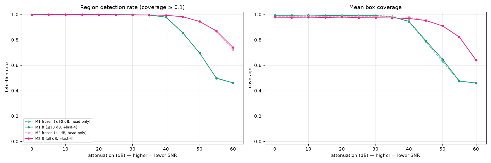
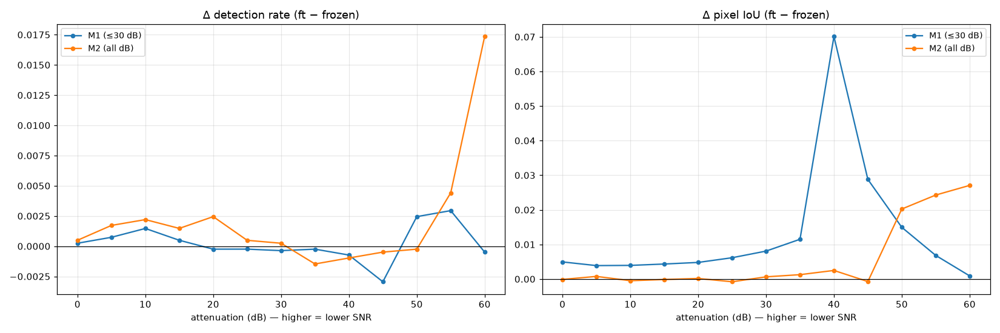

# Frozen head vs. backbone-adapted — is unfreezing worth the compute?

**Question:** for the fine-tuned DINOv3 signal detector, does unfreezing the last
transformer blocks (`ft`) beat a frozen-backbone segmentation-head probe (`frozen`) by
enough to justify the extra compute?

**Short answer: no, not for detection.** On the canonical batch-eval grid the frozen
and backbone-adapted models are **near-identical** — unfreezing moves region detection
by ≤0.02 and pixel-IoU by a few points, while costing **~1.45× the training time** (and
15.5× the trainable parameters). The dominant lever is the **training-data regime**
(all-dB **M2** ≫ ≤30-dB **M1** at low SNR), not backbone adaptation. Details, figures,
and the one place `ft` earns its keep are below.

Companion notebook: [`../notebooks/finetuned_variants_eval.ipynb`](../notebooks/finetuned_variants_eval.ipynb).

---

## 1. Setup

Four fine-tuned DINOv3 (ViT-B/16) detectors, scored by the **same canonical
`eval_detector_masks.py`** over the batch-eval captures (512×10240 grid, coverage ≥ 0.1
for "detected") — identical methodology to the other comparison notebooks, in an
isolated table set (`notebooks/compare_tables_finetuned/`).

| model | training data | trained weights | trainable params |
|---|---|---|---|
| **M1 frozen** | ≤30 dB | seg head only | 1.96 M |
| **M1 ft** | ≤30 dB | head + last-4 transformer blocks | 30.3 M |
| **M2 frozen** | all dB | seg head only | 1.96 M |
| **M2 ft** | all dB | head + last-4 blocks | 30.3 M |

---

## 2. Headline: the four are nearly the same (within each data regime)

**Region detection rate vs attenuation (coverage ≥ 0.1):**

| model | ≤30 dB | 40 dB | 45 dB | 50 dB | 55 dB | 60 dB | overall pixel IoU |
|---|---|---|---|---|---|---|---|
| M1 frozen | 1.00 | 0.98 | 0.86 | 0.69 | 0.50 | 0.46 | 0.731 |
| M1 ft | 1.00 | 0.98 | 0.85 | 0.70 | 0.50 | 0.46 | 0.744 |
| M2 frozen | 1.00 | 0.99 | 0.98 | 0.94 | 0.87 | 0.72 | 0.882 |
| M2 ft | 1.00 | 0.99 | 0.98 | 0.94 | 0.87 | 0.74 | 0.887 |



Within each data regime the frozen and ft curves sit on top of each other. The large,
real gap is **M1 vs M2** (training-data coverage): M2 holds 0.72–0.74 detection at 60 dB
where M1 collapses to 0.46. Frozen-vs-ft is in the noise by comparison.

Per-frame precision / recall / F1 / pixel-IoU / false-positive area vs SNR
(`figs_finetuned/frame_metrics_vs_snr.png`) tells the same story.

---

## 3. Does unfreezing help? Δ(ft − frozen)



- **Detection rate:** Δ stays within **±0.005** across almost the whole SNR range; the
  only positive excursion is **M2 at 55–60 dB (+0.004 → +0.017)** — i.e. a couple of
  extra regions found at the very noise floor. M1 is flat (even slightly negative at 45 dB).
- **Pixel-IoU (mask tightness):** small positive, generally **+0.005 to +0.03**, with one
  notable spike — **M1 at 40 dB (+0.07)** — where adapting the backbone tightens masks.
  M2's IoU gain only appears below 50 dB (+0.02–0.03).

So unfreezing yields *marginal* gains, concentrated in **mask-localization quality (IoU)**
rather than **whether the signal is found (detection)**, and mostly for the low-SNR-poor
M1 model around 40 dB.

---

## 4. The cost

From each run's `history.json` (18 epochs each; RTX 4000 Ada; batch 16):

| model | trainable params | s / epoch | total train | best val IoU |
|---|---|---|---|---|
| M1 frozen | 1.96 M | 155 | **46.4 min** | 0.744 |
| M1 ft | 30.3 M | 221 | **66.4 min** | 0.755 |
| M2 frozen | 1.96 M | 243 | **72.9 min** | 0.824 |
| M2 ft | 30.3 M | 360 | **108.0 min** | 0.798 |

- Unfreezing = **15.5× trainable parameters** and **~1.43–1.48× wall-clock training time**
  (M1 46→66 min, M2 73→108 min), plus higher optimizer/activation memory.
- **Inference cost is identical** for frozen and ft — both run a full ViT-B/16 forward;
  only the head differs in what was trained. So this is purely a *training*-compute trade.
- Note the val-IoU line: for **M2, frozen (0.824) actually beat ft (0.798)** — with enough
  training data, unfreezing didn't help and slightly hurt generalization on validation.

---

## 5. Verdict & recommendation

**Unfreezing the last-4 transformer blocks is not worth the extra compute for this task.**

- For **detection** (the primary metric), frozen ≈ ft everywhere (Δ ≤ 0.02).
- For **mask-IoU**, ft gives a small, situational bump (biggest: M1 @40 dB, +0.07); take it
  only if tight masks matter and the ~1.5× training budget is cheap.
- The **high-leverage** decision is the **training data**: M2 (all-dB) beats M1 (≤30 dB)
  by 0.2–0.3 detection at low SNR — far more than anything unfreezing buys.

**Recommendation:** default to the **frozen-head probe** (5× faster to train, 15× fewer
trainable params, same inference cost, essentially the same accuracy) and spend the saved
compute on **broader-SNR training data**. Reserve backbone unfreezing for cases where
low-SNR mask-tightness specifically matters.

---

## 6. Reproduce
```
# frozen masks on the batch grid (ft masks already in sweep_detectors)
python src/gen_finetuned_run.py --out-root notebooks/sweep_finetuned --detector-name m1_frozen \
       --ft-ckpt checkpoints/M1_frozen/best.pt --ft-eval-meta eval_out/M1_frozen/eval_meta.json --deployed ""
python src/gen_finetuned_run.py --out-root notebooks/sweep_finetuned --detector-name m2_frozen \
       --ft-ckpt checkpoints/M2_frozen/best.pt --ft-eval-meta eval_out/M2_frozen/eval_meta.json --deployed ""
# (m1_ft, m2_ft are symlinks to the finetuned_dino* dirs in sweep_detectors)
python <infocom_evals>/eval_detector_masks.py --batch-root notebooks/sweep_finetuned \
       --out-dir notebooks/compare_tables_finetuned --coverage-threshold 0.1
# then run notebooks/finetuned_variants_eval.ipynb  (kernel: Python (dinov3))
```

## Caveats
- "Detected" = box coverage ≥ 0.1 on each model's val-tuned decision threshold
  (frozen 0.20/0.70, ft 0.45/0.85) — each compared at its own operating point.
- GT boxes include buried signals at high attenuation, so absolute low-SNR numbers are
  conservative for all models (see the main report); here only the *frozen-vs-ft delta*
  matters and that comparison is apples-to-apples.
- `unfreeze_last_n = 4`; a larger unfreeze or full fine-tune could change the trade — not
  tested here.
