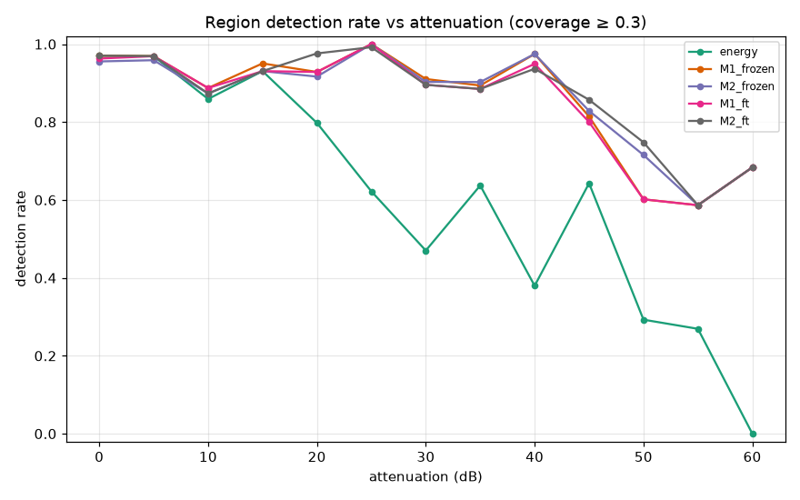
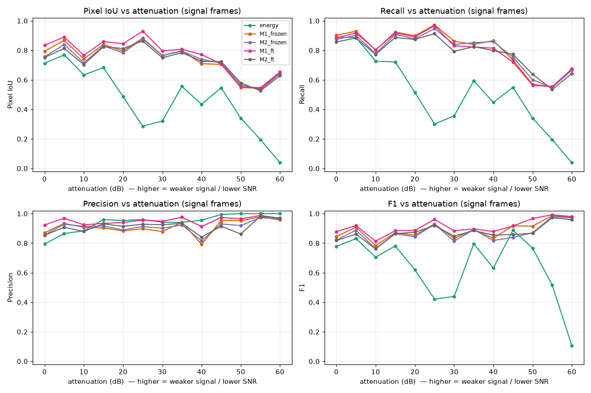
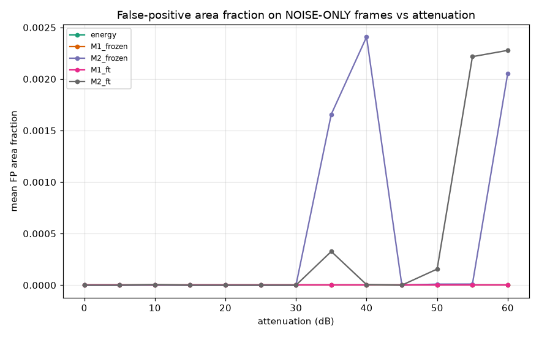
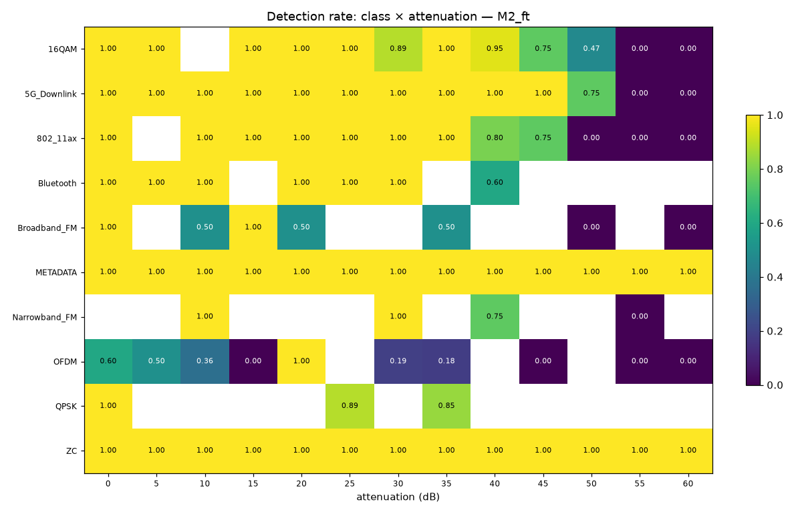
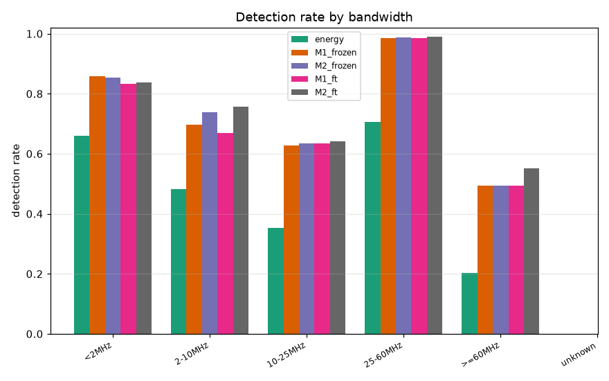
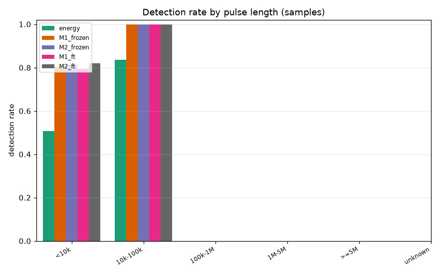

# Fine-Tuning DINOv3 for RF Signal Detection at Low SNR — Results

**Author:** generated for bqn82 (Brandon Nguyen) · **Run:** 2026-07-07/08
**Companion:** [`pipeline.md`](pipeline.md) (how the system works, end to end)

---

## TL;DR

- **Fine-tuning DINOv3 dramatically beats a classical energy detector at low SNR.**
  At **60 dB attenuation the energy detector detects 0%** of signal regions while the
  DINOv3 detectors still detect **68%**. The learned detectors degrade *gracefully*
  with SNR; the classical detector *collapses* (and erratically).
- **Overall pixel IoU** (all attenuations, signal frames): energy **0.45** →
  DINOv3 **0.73–0.77**. Best single model: **`M1_ft` (backbone-adapted, ≤30 dB) at
  IoU 0.765, F1 0.908, precision 0.951**.
- **Adapting the backbone (`ft`) vs a frozen-feature decoder (`frozen`) is a small,
  metric-dependent gain** — the *dominant* effect is learned-vs-classical, not the
  fine-tuning depth.
- **Training data range barely matters at the SNR extreme:** a model trained only on
  ≤30 dB (`M1`) detects at 60 dB *identically* to one trained on all data (`M2`,
  both 0.68) — **DINOv3 features transfer across SNR**. Adding low-SNR training data
  (`M2`) helps specifically around **50 dB** (+0.13 detection) but at a small
  false-positive cost.
- **Where it still fails:** **OFDM** (poorly detected even at high SNR, 0.36–0.60),
  **narrowband / very-wideband** emissions, and everything below ~50 dB SNR.
  **ZC and METADATA** markers are detected at 100% across *all* SNRs.

> Higher attenuation = weaker received signal = **lower SNR**. "Low SNR" = the
> right-hand side of every plot (40–60 dB).

---

## 1. Experimental design

Binary per-pixel **signal-vs-noise segmentation** on spectrograms, DINOv3 ViT-B/16.
Five detectors, all scored on the **same all-attenuation held-out test split**
(3,150 frames / 50,321 annotated regions spanning 0–60 dB):

| Detector | Training data | Backbone |
|---|---|---|
| `energy` | *none* (classical) | adaptive dB threshold (median + 4·MAD) |
| `M1_frozen` | ≤30 dB | frozen |
| `M1_ft` | ≤30 dB | last-4 blocks fine-tuned |
| `M2_frozen` | all dB | frozen |
| `M2_ft` | all dB | last-4 blocks fine-tuned |

This 2×2 grid (training data × adaptation depth) + classical baseline lets us
separate three questions: *learned vs classical*, *does adapting the backbone help*,
and *does low-SNR training data help*. See [`pipeline.md`](pipeline.md) for geometry,
labels, and all deviations from the original brief.

---

## 2. Headline: detection rate vs SNR

A GT region counts as *detected* if ≥30% of its box is covered by the predicted
signal mask.

- Through ~35 dB, **all** detectors do well (≥0.85) — high SNR is easy.
- Past 35 dB the **energy detector falls apart**: 0.47 @30 dB → 0.38 @40 dB →
  0.29 @50 dB → **0.00 @60 dB**, and non-monotonically (it's threshold-fragile).
- The **DINOv3 detectors degrade smoothly** and stay far above: ~0.90 through 40 dB,
  ~0.72–0.75 @50 dB, **0.68 @60 dB**.

**Detection rate by attenuation (coverage ≥ 0.30):**

| model | 30 dB | 40 dB | 45 dB | 50 dB | 55 dB | 60 dB |
|---|---|---|---|---|---|---|
| energy    | 0.47 | 0.38 | 0.64 | 0.29 | 0.27 | **0.00** |
| M1_frozen | 0.91 | 0.97 | 0.81 | 0.60 | 0.59 | 0.68 |
| M2_frozen | 0.90 | 0.97 | 0.83 | 0.72 | 0.59 | 0.68 |
| M1_ft     | 0.90 | 0.95 | 0.80 | 0.60 | 0.59 | 0.68 |
| M2_ft     | 0.90 | 0.94 | 0.86 | **0.75** | 0.59 | 0.68 |

---

## 3. Pixel-level quality

**Overall (all-dB, signal frames):**

| model | IoU | F1 | precision | recall | FP-area (noise frames) |
|---|---|---|---|---|---|
| energy    | 0.448 | 0.630 | 0.933 | 0.491 | 0.0000 |
| M1_frozen | 0.741 | 0.883 | 0.907 | 0.808 | 0.0000 |
| M2_frozen | 0.735 | 0.865 | 0.908 | 0.799 | 0.0004 |
| **M1_ft** | **0.765** | **0.908** | **0.951** | 0.796 | 0.0000 |
| M2_ft     | 0.729 | 0.869 | 0.910 | 0.782 | 0.0004 |

The energy detector is *precise* (0.933) but low *recall* (0.491) — it only marks
the strongest pixels and misses weak signal, which is exactly why its detection rate
craters at low SNR. The DINOv3 detectors nearly **double the IoU** and lift recall to
~0.80 while keeping precision ≥0.90.

---

## 4. False-positive behavior (precision on pure noise)

On **noise-only frames**, all detectors are very clean (**<0.25% of area** ever
falsely flagged). Two honest nuances:

- `M1_*` and `energy` are essentially **zero false-positive** at every SNR.
- The **`M2_*`** models (trained on very-low-SNR frames where signal ≈ noise) become
  slightly trigger-happy on noise at 35–60 dB (up to 0.24% area). This is the
  flip side of their better 50 dB detection — a small precision/recall tradeoff from
  training on ambiguous examples.

---

## 5. Where it fails — by waveform class

(Detection rate per waveform class × attenuation for `M2_ft`; white = no test
regions in that cell. Per-class test counts: ZC 330, METADATA 376, 16QAM 179,
5G_Downlink 160, OFDM 94, 802_11ax 75, Bluetooth 55, QPSK 35, Broadband_FM 16,
Narrowband_FM 16 — treat the two FM rows as low-n / anecdotal.)

- **Trivially robust at all SNRs (1.00 everywhere):** `ZC` (Zadoff-Chu) and
  `METADATA`. These are wideband/structured framing markers — easy energy targets
  even at 60 dB, and they **inflate the aggregate numbers**, so read the per-class
  view alongside the headline.
- **Graceful, strong classes:** `5G_Downlink` (1.00 to 45 dB), `16QAM` and
  `802_11ax` (1.00 to ~35 dB, then decline through 45–50 dB). These wideband
  modulated signals are where fine-tuning shines.
- **Hardest class — `OFDM`:** poorly detected **even at high SNR** (0.60 @0 dB,
  0.36 @10 dB, and mostly ≤0.20 elsewhere). OFDM's noise-like time-frequency
  footprint is easily confused with the noise floor. This is the clearest target
  for future work.
- **Narrowband / FM:** sparse and weak — consistent with the sub-pixel frequency
  resolution limit (see §7).

---

## 6. Where it fails — by bandwidth and duration

**Detection rate by occupied bandwidth** (all-dB pooled):

| bandwidth | energy | M1_ft | M2_ft | n |
|---|---|---|---|---|
| <2 MHz     | 0.66 | 0.83 | 0.84 | 197 |
| 2–10 MHz   | 0.48 | 0.67 | 0.76 | 172 |
| 10–25 MHz  | 0.35 | 0.63 | 0.64 | 142 |
| 25–60 MHz  | 0.71 | 0.99 | **0.99** | 736 |
| ≥60 MHz    | 0.20 | 0.49 | 0.55 | 89 |

- DINOv3 beats energy in **every** bandwidth bucket, most decisively at 25–60 MHz
  (0.99 vs 0.71) — the bulk of the emissions.
- **Very-wideband (≥60 MHz)** is comparatively weak (0.55): these near-band-filling
  signals blur into the noise floor and partly exceed the captured band.
- `M2_ft` > `M1_ft` on mid/wide bands (2–10 MHz: 0.76 vs 0.67; ≥60 MHz: 0.55 vs
  0.49) — including low-SNR training data helps these.

By duration, longer emissions are detected more reliably (10k–100k-sample regions:
1.00; sub-10k: 0.82) — longer dwell = more time-domain evidence.

---

## 7. Answering the core question

**"Does fine-tuning DINOv3 improve signal detection at low SNR?"**

- **Versus a classical detector: emphatically yes.** At 50–60 dB the learned
  detectors deliver 0.68–0.75 detection where energy delivers 0.00–0.29, and roughly
  double the pixel IoU overall. A DINOv3-based detector is meaningfully more capable
  in exactly the low-SNR regime that matters.
- **Versus a frozen-feature decoder on the same backbone: a small, real, but
  metric-dependent gain.** `M1_ft` gives the best aggregate pixel IoU/precision;
  `M2_ft` gives the best 45–50 dB detection; the `frozen` variants are close behind.
  The stock DINOv3 features are already highly informative for spectrograms — most of
  the benefit comes from learning *any* decoder, with backbone adaptation adding a
  modest top-up.
- **Training-data coverage:** low-SNR training data (`M2`) helps around 50 dB and on
  mid/wide bandwidths, at a small false-positive cost, and makes **no** difference at
  the 60 dB extreme (features transfer: `M1`, trained only ≤30 dB, matches `M2`
  there). A practical recommendation: **`M2_ft`** if you care most about the 45–55 dB
  band; **`M1_ft`** if you want the cleanest precision and best aggregate IoU.

---

## 8. Caveats & limitations

- **Aggregates are inflated by ZC/METADATA** (100% at all SNRs, ~14% of test
  regions each). The per-class heatmap is the honest view.
- **Small-n cells:** FM classes have only 16 test regions each; some heatmap cells
  are one or two regions. Detection differences <~0.1 between the four learned
  variants are within noise.
- **Sub-pixel frequency limit:** at 240 kHz/bin, emissions narrower than ~one bin
  (some FM tones) cannot be localized well by *any* method here — a grid choice, not
  a model failure. A finer-`nfft` variant would test them fairly.
- **Temporal split within captures** (guard-gapped) rather than a capture-level
  hold-out; some residual correlation between train and test frames is possible.
- **Detection threshold** (coverage ≥0.30) and the val-tuned operating point are
  single points; ROC/PR-vs-SNR sweeps would add rigor.

---

## 9. Suggested next steps

1. **Fix OFDM** — the standout weakness. Try class-balanced sampling, a finer `nfft`,
   or a phase/coherence-aware input channel.
2. **ROC / PR vs SNR** at multiple operating thresholds; report AUC-vs-dB.
3. **A LoRA or full fine-tune** variant to see if deeper adaptation closes the
   remaining gap below 50 dB (last-4-block `ft` gained little over frozen here).
4. **Higher-`nfft` dataset** to give narrowband/FM a fair chance, then re-slice.
5. **Capture-level hold-out** (train on a subset of captures, test on unseen ones) to
   measure cross-capture generalization.
6. Fold the winning checkpoint back into the deployed `cuda_dino` detector and
   compare live against the existing zero-shot DINO + classical baselines.

---

### Reproducibility

All numbers come from `eval_out/<model>/{frame,region}_metrics.csv`; figures from
`src/report.py`; machine-readable aggregates in `reports/summary.json`. Full
commands and the resumable orchestrator (`scripts/run_full.sh`) are documented in
[`pipeline.md`](pipeline.md). The overnight run held steady on a shared machine
(peak swap 6.5 GB, ≥90 GB RAM free throughout, logged in `reports/resource.log`).
